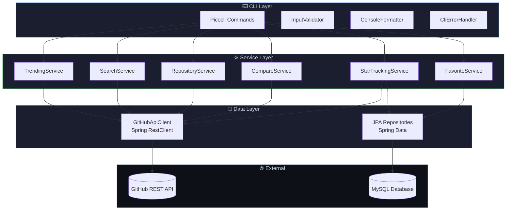

<div align="center">

<!-- ═══════════════════════════════════════════════════════════════ -->
<!--                     ANIMATED HEADER BANNER                      -->
<!-- ═══════════════════════════════════════════════════════════════ -->


<!-- Typing SVG Animation -->
<a href="https://github.com/akkiiop/github-developer-insights">
  
</a>

<br/>

<!-- ═══════════════════════════════════════════════════════════════ -->
<!--                        BADGE ROWS                               -->
<!-- ═══════════════════════════════════════════════════════════════ -->

<!-- Tech Stack Badges -->
<p>
  
  
  
  
  
</p>

<!-- Status Badges -->
<p>
  <a href="LICENSE"></a>
  
  
  
</p>

<!-- ═══════════════════════════════════════════════════════════════ -->
<!--                     QUICK NAVIGATION                            -->
<!-- ═══════════════════════════════════════════════════════════════ -->

<p>
  <a href="#-project-overview">Overview</a>&nbsp;&nbsp;•&nbsp;&nbsp;
  <a href="#-features">Features</a>&nbsp;&nbsp;•&nbsp;&nbsp;
  <a href="#-architecture">Architecture</a>&nbsp;&nbsp;•&nbsp;&nbsp;
  <a href="#-getting-started">Quick Start</a>&nbsp;&nbsp;•&nbsp;&nbsp;
  <a href="#-usage--commands">Commands</a>&nbsp;&nbsp;•&nbsp;&nbsp;
  <a href="#-testing">Testing</a>&nbsp;&nbsp;•&nbsp;&nbsp;
  <a href="#-license">License</a>
</p>

</div>

<br/>

<!-- ═══════════════════════════════════════════════════════════════ -->
<!--                     PROJECT OVERVIEW                            -->
<!-- ═══════════════════════════════════════════════════════════════ -->

## 🎯 Project Overview

> **GitHub Developer Insights** is a Spring Boot command-line application that integrates with the **GitHub REST API** to help developers discover, search, compare, and monitor public repositories — all from the terminal.

<table>
<tr>
<td width="50%">

### 🧩 What It Does
A terminal-first tool that puts the entire GitHub ecosystem at your fingertips. No browser needed — search trending repos, compare projects side-by-side, track star growth over time, and maintain a personal favorites list.

</td>
<td width="50%">

### 🔧 Built With
- **Picocli** — CLI commands & argument parsing
- **Spring Boot** — DI & application configuration
- **Spring RestClient** — GitHub API communication
- **Jackson** — JSON-to-DTO mapping
- **Spring Data JPA + MySQL** — Persistent storage
- **JUnit 5 + Mockito** — Automated testing

</td>
</tr>
</table>

---

<!-- ═══════════════════════════════════════════════════════════════ -->
<!--                        FEATURES                                 -->
<!-- ═══════════════════════════════════════════════════════════════ -->

## ✨ Features

<table>
<tr>
  <td align="center" width="140">
    <br/>
    
    <br/><br/>
    <sub><b>Trending Repos</b></sub>
    <br/>
    <sub>Discover what's hot by<br/>duration & language</sub>
    <br/><br/>
  </td>
  <td align="center" width="140">
    <br/>
    
    <br/><br/>
    <sub><b>Smart Search</b></sub>
    <br/>
    <sub>Sort, filter, and<br/>explore GitHub repos</sub>
    <br/><br/>
  </td>
  <td align="center" width="140">
    <br/>
    
    <br/><br/>
    <sub><b>Repo Details</b></sub>
    <br/>
    <sub>Comprehensive info<br/>for any public repo</sub>
    <br/><br/>
  </td>
  <td align="center" width="140">
    <br/>
    
    <br/><br/>
    <sub><b>Compare Repos</b></sub>
    <br/>
    <sub>Side-by-side metrics<br/>with difference calc</sub>
    <br/><br/>
  </td>
  <td align="center" width="140">
    <br/>
    
    <br/><br/>
    <sub><b>Star Tracking</b></sub>
    <br/>
    <sub>Track star growth<br/>over time with DB</sub>
    <br/><br/>
  </td>
  <td align="center" width="140">
    <br/>
    
    <br/><br/>
    <sub><b>Favorites</b></sub>
    <br/>
    <sub>Save, list & remove<br/>your favorite repos</sub>
    <br/><br/>
  </td>
</tr>
</table>

---

<!-- ═══════════════════════════════════════════════════════════════ -->
<!--                      ARCHITECTURE                               -->
<!-- ═══════════════════════════════════════════════════════════════ -->

## 🏛️ Architecture

The application follows a **layered architecture** with clean separation of concerns:



<details>
<summary><kbd>📂 Click to expand full package structure</kbd></summary>
<br/>

```
com.githubinsights.github_developer_insights/
│
├── 📁 cli/                         # Picocli command definitions
│   ├── GithubInsightsCommand.java        # Root CLI command
│   ├── TrendingCommand.java              # trending subcommand
│   ├── SearchCommand.java                # search subcommand
│   ├── RepositoryCommand.java            # repository subcommand
│   ├── CompareCommand.java               # compare subcommand
│   ├── StarsCommand.java                 # stars subcommand
│   ├── FavoriteCommand.java              # favorite subcommand
│   ├── RemoveFavoriteCommand.java        # favorite remove
│   ├── ListFavoriteCommand.java          # favorite list
│   └── 📁 util/
│       ├── CliErrorHandler.java          # HTTP error handling
│       ├── ConsoleFormatter.java         # Output formatting
│       └── InputValidator.java           # Input validation
│
├── 📁 client/
│   └── GitHubApiClient.java              # RestClient for GitHub API
│
├── 📁 dto/
│   ├── RepositoryDto.java                # Repository data model
│   └── SearchResponseDto.java            # Search response wrapper
│
├── 📁 entity/
│   ├── Favorite.java                     # JPA favorite entity
│   └── StarSnapshot.java                 # JPA star snapshot entity
│
├── 📁 exception/
│   └── GitHubApiException.java           # Custom API exception
│
├── 📁 repository/
│   ├── FavoriteRepository.java           # Favorite JPA repository
│   └── StarSnapshotRepository.java       # Snapshot JPA repository
│
└── 📁 service/
    ├── TrendingService.java              # Trending logic
    ├── SearchService.java                # Search logic
    ├── RepositoryService.java            # Repo details logic
    ├── CompareService.java               # Comparison logic
    ├── StarTrackingService.java          # Star tracking logic
    └── FavoriteService.java              # Favorites logic
```

</details>

---

<!-- ═══════════════════════════════════════════════════════════════ -->
<!--                      TECH STACK                                 -->
<!-- ═══════════════════════════════════════════════════════════════ -->

## 🛠️ Tech Stack

<table>
<tr>
  <th>Layer</th>
  <th>Technology</th>
  <th>Version</th>
  <th>Purpose</th>
</tr>
<tr>
  <td></td>
  <td><strong>Java</strong></td>
  <td><code>21</code></td>
  <td>Modern Java with latest language features</td>
</tr>
<tr>
  <td></td>
  <td><strong>Spring Boot</strong></td>
  <td><code>4.1.1</code></td>
  <td>Application framework & dependency injection</td>
</tr>
<tr>
  <td></td>
  <td><strong>Spring Data JPA</strong></td>
  <td>—</td>
  <td>Database persistence layer</td>
</tr>
<tr>
  <td></td>
  <td><strong>Spring RestClient</strong></td>
  <td>—</td>
  <td>HTTP client for GitHub API</td>
</tr>
<tr>
  <td></td>
  <td><strong>Picocli</strong></td>
  <td><code>4.7.7</code></td>
  <td>Command-line argument parsing</td>
</tr>
<tr>
  <td></td>
  <td><strong>MySQL</strong></td>
  <td><code>8.0+</code></td>
  <td>Persistent favorites & star snapshots</td>
</tr>
<tr>
  <td></td>
  <td><strong>Maven</strong></td>
  <td><code>3.9+</code></td>
  <td>Build tool & dependency management</td>
</tr>
</table>

---

<!-- ═══════════════════════════════════════════════════════════════ -->
<!--                     PREREQUISITES                               -->
<!-- ═══════════════════════════════════════════════════════════════ -->

## 📦 Prerequisites

| # | Requirement | Min Version | Install Link |
|:-:|:---|:---|:---|
| 1 | ☕ **Java JDK** | `21+` | [↗ Adoptium](https://adoptium.net/) |
| 2 | 📦 **Maven** | `3.9+` | [↗ Apache Maven](https://maven.apache.org/download.cgi) |
| 3 | 🐬 **MySQL** | `8.0+` | [↗ MySQL Downloads](https://dev.mysql.com/downloads/) |

---

<!-- ═══════════════════════════════════════════════════════════════ -->
<!--                     GETTING STARTED                             -->
<!-- ═══════════════════════════════════════════════════════════════ -->

## 🚀 Getting Started

<table>
<tr>
<td>

### `1` &nbsp; Clone the repository

```bash
git clone https://github.com/akkiiop/github-developer-insights.git
cd github-developer-insights/github-developer-insights
```

### `2` &nbsp; Set up the MySQL database

```sql
CREATE DATABASE github_insights;
```

### `3` &nbsp; Configure database credentials

Edit `src/main/resources/application.properties`:

```properties
spring.datasource.url=jdbc:mysql://localhost:3306/github_insights
spring.datasource.username=your_username
spring.datasource.password=your_password
```

### `4` &nbsp; Build the project

```bash
./mvnw clean package -DskipTests
```

### `5` &nbsp; Run the application

```bash
java -jar target/github-developer-insights-0.0.1-SNAPSHOT.jar <command> [options]
```

</td>
</tr>
</table>

---

<!-- ═══════════════════════════════════════════════════════════════ -->
<!--                     USAGE & COMMANDS                            -->
<!-- ═══════════════════════════════════════════════════════════════ -->

## 📖 Usage & Commands

<!-- ──────────────────── TRENDING ──────────────────── -->

###  &nbsp; Trending Repositories

> Discover trending repositories created within a specified time period.

```bash
# Default: top 10 trending repos from the past week
java -jar target/*.jar trending

# Trending repos from the past month, limited to 5
java -jar target/*.jar trending --duration month --limit 5

# Trending Python repos from the past day
java -jar target/*.jar trending --duration day --language Python
```

<details>
<summary><kbd>⚙️ Options</kbd></summary>
<br/>

| Option | Description | Default | Values |
|:---|:---|:---:|:---|
| `--duration` | Time period to search | `week` | `day` · `week` · `month` · `year` |
| `--limit` | Max repositories to display | `10` | `1` – `100` |
| `--language` | Filter by programming language | — | Any language name |

</details>

<details>
<summary><kbd>💻 Example Output</kbd></summary>

```
GitHub Trending Repositories
----------------------------------
Duration: week
Limit: 5
Search Query: created:>2026-09-27 stars:>100

Repositories Found: 12,345

facebook/react
Language: JavaScript
Stars: 230000
----------------------------------
```

</details>

---

<!-- ──────────────────── SEARCH ──────────────────── -->

###  &nbsp; Search Repositories

> Search GitHub repositories with advanced filtering and sorting.

```bash
# Search for machine learning repos
java -jar target/*.jar search --query "machine learning"

# Search Rust web frameworks, sorted by forks
java -jar target/*.jar search --query "web framework" --language Rust --sort forks --limit 5

# Search with ascending order
java -jar target/*.jar search --query "cli tool" --sort updated --order asc
```

<details>
<summary><kbd>⚙️ Options</kbd></summary>
<br/>

| Option | Description | Default | Values |
|:---|:---|:---:|:---|
| `--query` | Search query | **required** | Any text |
| `--limit` | Max results | `10` | `1` – `100` |
| `--language` | Filter by language | — | Any language name |
| `--sort` | Sort criteria | `stars` | `stars` · `forks` · `updated` |
| `--order` | Sort order | `desc` | `asc` · `desc` |

</details>

<details>
<summary><kbd>💻 Example Output</kbd></summary>

```
GitHub Repository Search
----------------------------------
Query: web framework
Language: Rust
Sort: forks | Order: desc
Repositories Found: 845

nickel-org/nickel.rs
Language: Rust
Stars: 3200
Forks: 180
----------------------------------
```

</details>

---

<!-- ──────────────────── REPOSITORY ──────────────────── -->

###  &nbsp; Repository Details

> View detailed information about a specific repository.

```bash
java -jar target/*.jar repository spring-projects/spring-boot
java -jar target/*.jar repository torvalds/linux
```

<details>
<summary><kbd>💻 Example Output</kbd></summary>

```
Repository Details
----------------------------------
Name: spring-boot
Full Name: spring-projects/spring-boot
Description: Spring Boot helps you to create Spring-powered applications
Language: Java
Stars: 75000
Forks: 40000
Open Issues: 500
Default Branch: main
Archived: false
Fork: false
URL: https://github.com/spring-projects/spring-boot
```

</details>

---

<!-- ──────────────────── COMPARE ──────────────────── -->

###  &nbsp; Compare Repositories

> Side-by-side comparison of two repositories with a formatted table.

```bash
java -jar target/*.jar compare facebook/react angular/angular
java -jar target/*.jar compare spring-projects/spring-boot quarkusio/quarkus
```

<details>
<summary><kbd>💻 Example Output</kbd></summary>

```
================================================================
                    REPOSITORY COMPARISON
================================================================

Metric                         react         angular      Difference
----------------------------------------------------------------
Stars                        230,000        96,000       -134,000
Forks                         47,000        25,000        -22,000
Open Issues                    1,200           850          -350
----------------------------------------------------------------
Language                  JavaScript      TypeScript             -
Archived                       false           false             -
Fork                           false           false             -
================================================================
```

</details>

---

<!-- ──────────────────── STARS ──────────────────── -->

###  &nbsp; Star Tracking

> Track star growth over time. Each run saves a snapshot to the database.

```bash
# Save a star snapshot and show growth summary
java -jar target/*.jar stars torvalds/linux

# Show complete star history table
java -jar target/*.jar stars torvalds/linux --history
```

<details>
<summary><kbd>⚙️ Options</kbd></summary>
<br/>

| Option | Description |
|:---|:---|
| `--history` | Display complete star history table instead of growth summary |

</details>

<details>
<summary><kbd>💻 Growth Summary</kbd></summary>

```
Star Growth
==================================================
Repository: torvalds/linux

First Snapshot : 180000
Latest Snapshot: 185000
Growth         : +5000
Snapshots      : 12
First Captured : 2026-09-01T10:30:00
Latest Captured: 2026-10-03T20:00:00
```

</details>

<details>
<summary><kbd>💻 History Table (--history)</kbd></summary>

```
Star History
==================================================
Repository: torvalds/linux

Captured At               Stars
------------------------------------------
2026-09-01T10:30:00       180000
2026-09-15T14:00:00       182000
2026-10-03T20:00:00       185000
------------------------------------------
Total Growth: +5000
Snapshots: 3
```

</details>

---

<!-- ──────────────────── FAVORITES ──────────────────── -->

###  &nbsp; Favorites Management

> Save repositories to your local favorites for quick access.

```bash
# Add a repository to favorites
java -jar target/*.jar favorite torvalds/linux

# List all favorites
java -jar target/*.jar favorite list

# Remove from favorites
java -jar target/*.jar favorite remove torvalds/linux
```

<details>
<summary><kbd>💻 Example Output</kbd></summary>

```
======================================================================
 Favorite Repositories
======================================================================

ID    Repository                          Added At
----------------------------------------------------------------------
1     torvalds/linux                      2026-10-01 14:30:00
2     spring-projects/spring-boot         2026-10-02 09:15:00
3     facebook/react                      2026-10-03 20:00:00
----------------------------------------------------------------------

Total Favorites: 3
```

</details>

---

<!-- ═══════════════════════════════════════════════════════════════ -->
<!--                     CONFIGURATION                               -->
<!-- ═══════════════════════════════════════════════════════════════ -->

## ⚙️ Configuration

All settings are in `src/main/resources/application.properties`:

```properties
# ═══════ GitHub API ═══════
github.api.base-url=https://api.github.com
github.api.default-limit=10
github.api.max-limit=100
github.api.min-stars=100

# ═══════ Database ═══════
spring.datasource.url=jdbc:mysql://localhost:3306/github_insights
spring.datasource.username=root
spring.datasource.password=your_password

spring.jpa.hibernate.ddl-auto=update
spring.jpa.show-sql=false
spring.jpa.properties.hibernate.format_sql=true
```

---

<!-- ═══════════════════════════════════════════════════════════════ -->
<!--                       TESTING                                   -->
<!-- ═══════════════════════════════════════════════════════════════ -->

## 🧪 Testing

<table>
<tr>
<td width="50%">

### 🔬 Unit Tests

| Test Class | Validates |
|:---|:---|
| `InputValidatorTest` | Repository format, limit range, duration, sort & order inputs |
| `FavoriteServiceTest` | Favorite creation & duplicate-favorite handling (Mockito mocks) |

</td>
<td width="50%">

### 🔗 Integration Tests

| Test Class | Validates |
|:---|:---|
| `GithubDeveloperInsightsApplicationTests` | Spring Boot application context loads successfully |
| `FavoriteServiceIntegrationTest` | Spring integration-test configuration |

</td>
</tr>
</table>

```bash
# Run all tests
./mvnw test

# Run a specific test class
./mvnw test -Dtest=InputValidatorTest
./mvnw test -Dtest=FavoriteServiceTest
```

---

<!-- ═══════════════════════════════════════════════════════════════ -->
<!--                    DATABASE SCHEMA                              -->
<!-- ═══════════════════════════════════════════════════════════════ -->

## 🗄️ Database Schema

> Tables are auto-created via JPA (`ddl-auto=update`)

<table>
<tr>
<td width="50%">

### `favorite`

| Column | Type | Key |
|:---|:---|:---:|
| `id` | `BIGINT` | 🔑 PK |
| `owner` | `VARCHAR` | |
| `repository_name` | `VARCHAR` | |
| `created_at` | `DATETIME` | |

</td>
<td width="50%">

### `star_snapshot`

| Column | Type | Key |
|:---|:---|:---:|
| `id` | `BIGINT` | 🔑 PK |
| `owner` | `VARCHAR` | |
| `repository_name` | `VARCHAR` | |
| `stars` | `INT` | |
| `captured_at` | `DATETIME` | |

</td>
</tr>
</table>

---

<!-- ═══════════════════════════════════════════════════════════════ -->
<!--                    ERROR HANDLING                                -->
<!-- ═══════════════════════════════════════════════════════════════ -->

## 🔧 Error Handling

The CLI provides user-friendly error messages for common GitHub API errors:

| Code | Status | Message |
|:---:|:---|:---|
| `400` | 🔴 Bad Request | Invalid request |
| `401` | 🔐 Unauthorized | GitHub authentication failed |
| `403` | 🚫 Forbidden | Access denied or rate limit reached |
| `404` | ❓ Not Found | Repository or resource not found |
| `422` | ⚠️ Unprocessable | GitHub could not process the request |
| `5xx` | 💥 Server Error | GitHub server error, try again later |
| `-1` | 🔌 Network | Could not connect to GitHub API |

---

<!-- ═══════════════════════════════════════════════════════════════ -->
<!--                   PROJECT STRUCTURE                             -->
<!-- ═══════════════════════════════════════════════════════════════ -->

## 📁 Project Structure

```
github-developer-insights/              ← Repository root
│
├── 📄 README.md                        ← You are here
├── 📄 LICENSE                          ← MIT License
├── 📄 .gitignore
│
└── 📂 github-developer-insights/       ← Spring Boot module
    ├── 📄 pom.xml                      ← Maven configuration
    ├── 📄 mvnw / mvnw.cmd             ← Maven wrapper
    │
    └── 📂 src/
        ├── 📂 main/
        │   ├── 📂 java/               ← Application source code
        │   └── 📂 resources/
        │       └── application.properties
        └── 📂 test/
            └── 📂 java/               ← Unit & integration tests
```

---

<!-- ═══════════════════════════════════════════════════════════════ -->
<!--                     CONTRIBUTING                                -->
<!-- ═══════════════════════════════════════════════════════════════ -->

## 🤝 Contributing

Contributions are welcome! Here's the workflow:

```
1. 🍴 Fork the repository
2. 🌿 Create a branch          →  git checkout -b feature/amazing-feature
3. 💾 Commit your changes      →  git commit -m 'Add amazing feature'
4. 📤 Push to the branch       →  git push origin feature/amazing-feature
5. 🔀 Open a Pull Request
```

---

<!-- ═══════════════════════════════════════════════════════════════ -->
<!--                       LICENSE                                   -->
<!-- ═══════════════════════════════════════════════════════════════ -->

## 📄 License

This project is open source and available under the [MIT License](LICENSE).

---

<!-- ═══════════════════════════════════════════════════════════════ -->
<!--                        FOOTER                                   -->
<!-- ═══════════════════════════════════════════════════════════════ -->

<div align="center">

### 👤 Author

**akkiiop** — [GitHub Profile](https://github.com/akkiiop)

<br/>

<a href="https://github.com/akkiiop/github-developer-insights/stargazers">
  
</a>
&nbsp;&nbsp;
<a href="https://github.com/akkiiop/github-developer-insights/network/members">
  
</a>

<br/><br/>


<sub>⭐ If you found this project useful, consider giving it a star!</sub>

</div>
