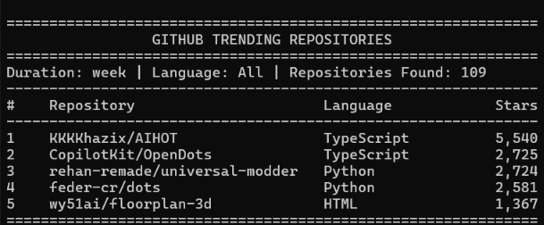
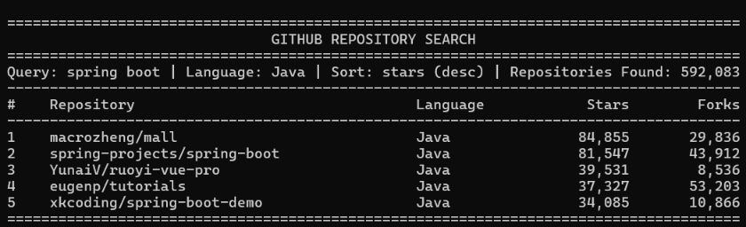
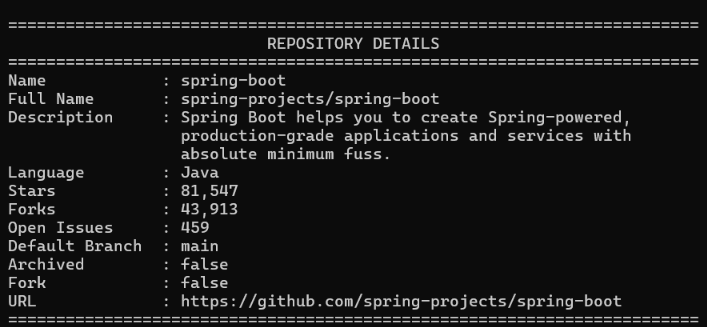
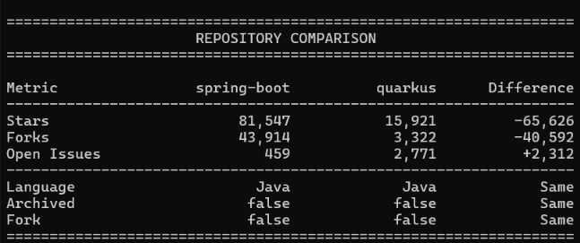
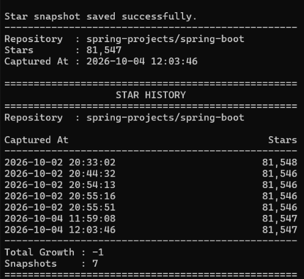
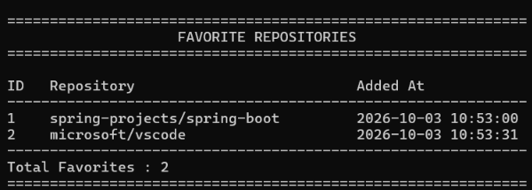
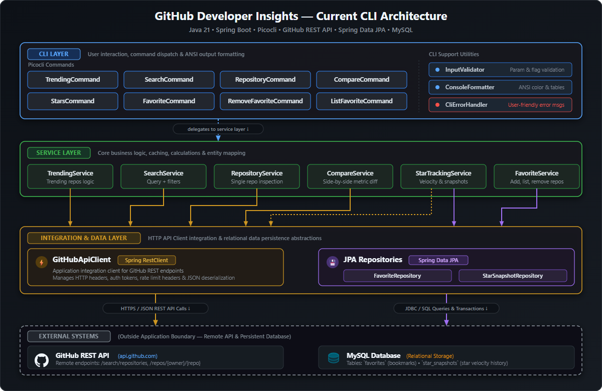
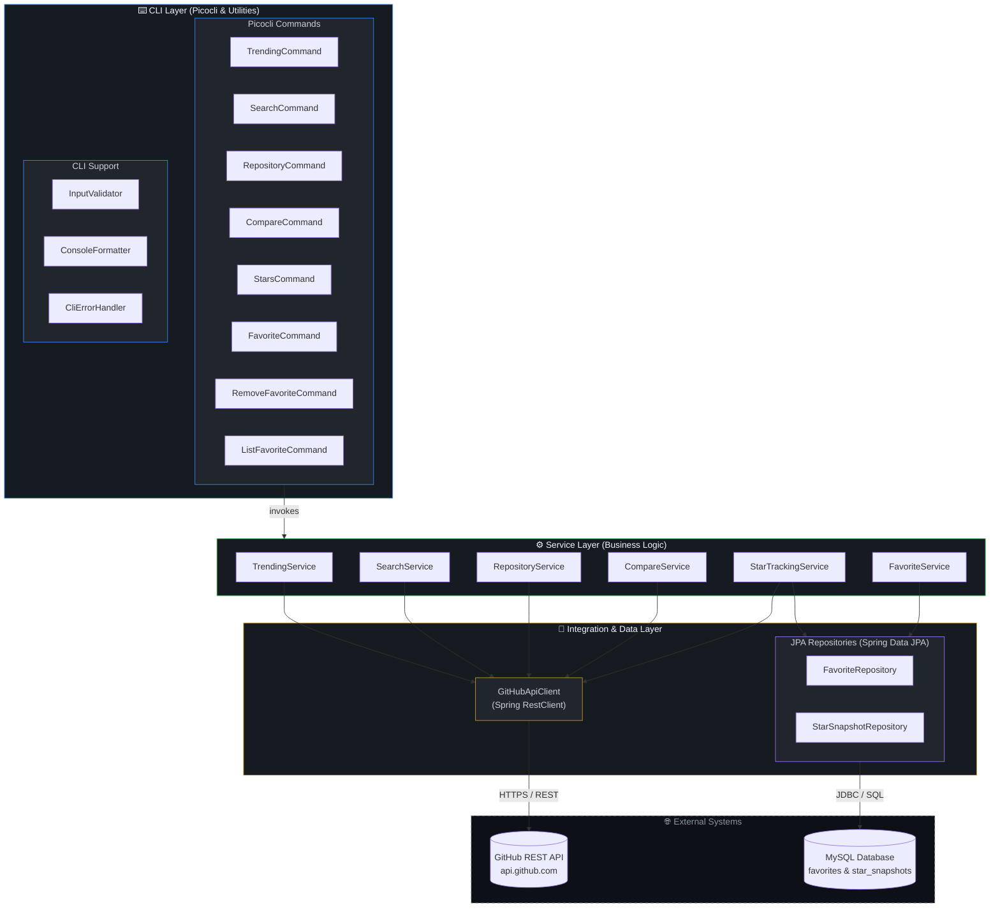

<div align="center">

<!-- ═══════════════════════════════════════════════════════════════ -->
<!--                     ANIMATED HEADER BANNER                      -->
<!-- ═══════════════════════════════════════════════════════════════ -->


<!-- Typing SVG Tagline -->
<a href="https://github.com/akkiiop/github-developer-insights">
  
</a>

<!-- Badges -->
<p>
  
  
  
  
  
  
</p>
<p>
  <a href="LICENSE"></a>
  
  
  
</p>
<p>
  <a href="https://www.loom.com/share/56b18d1b5f3a49f3b75e3df18b23fb69" target="_blank">
    
  </a>
</p>

<!-- Quick Navigation -->
<p>
  <a href="#-project-overview">Overview</a>&nbsp;&nbsp;•&nbsp;&nbsp;
  <a href="#-why-this-project">Why This Project?</a>&nbsp;&nbsp;•&nbsp;&nbsp;
  <a href="#-features">Features</a>&nbsp;&nbsp;•&nbsp;&nbsp;
  <a href="#-cli-preview">CLI Preview</a>&nbsp;&nbsp;•&nbsp;&nbsp;
  <a href="#-architecture">Architecture</a>&nbsp;&nbsp;•&nbsp;&nbsp;
  <a href="#-key-engineering-concepts">Engineering Concepts</a>&nbsp;&nbsp;•&nbsp;&nbsp;
  <a href="#-tech-stack">Tech Stack</a>&nbsp;&nbsp;•&nbsp;&nbsp;
  <a href="#-getting-started">Getting Started</a>&nbsp;&nbsp;•&nbsp;&nbsp;
  <a href="#-usage--commands">Commands</a>&nbsp;&nbsp;•&nbsp;&nbsp;
  <a href="#-testing">Testing</a>&nbsp;&nbsp;•&nbsp;&nbsp;
  <a href="#-license">License</a>
</p>

</div>

---

## 🎯 Project Overview

**GitHub Developer Insights** is an open-source command-line tool built with **Java 21** and **Spring Boot 4.1.1** that brings repository discovery, analysis, and tracking directly to your terminal.

- **What it does**: Allows developers to discover fast-growing repositories, search projects with multi-criteria filtering, inspect repository metadata, run side-by-side metric comparisons, snapshot star counts to track growth over time, and manage a persistent local list of bookmarked repositories.
- **How it works**: Uses **Picocli** for command dispatch and input validation, Spring's **RestClient** to communicate with the public GitHub REST API, Jackson for JSON-to-DTO deserialization, and **Spring Data JPA** with **MySQL** for relational persistence of favorites and star snapshots.
- **Why it matters**: Provides a fast, scriptable terminal workflow for developers exploring repositories, comparing projects, and tracking repository growth.

---

## 💡 Why This Project?

Developers frequently find themselves switching between GitHub search filters, repository homepages, release metrics, and external comparison sites when evaluating libraries, tracking open-source competitors, or researching technology stacks.

This project addresses that friction by:
- **Consolidating repository workflows**: Combines search, inspection, side-by-side comparison, and velocity tracking into a unified CLI.
- **Eliminating browser context switching**: Retrieves key repository metrics (stars, forks, open issues, language, branches, archive status) straight into terminal stdout.
- **Enabling local star tracking**: Stores point-in-time snapshots in MySQL so developers can measure star growth and changes over time without third-party services.
- **Demonstrating modern Spring Boot CLI patterns**: Showcases non-web Spring Boot architectures, constructor-based dependency injection, clean layered separation, and robust CLI error handling.

---

## ✨ Features

<table width="100%">
<tr valign="top">
  <td align="center" width="16.66%" valign="top">
    
    <br/><br/>
    <b>Trending Discovery</b>
    <br/>
    <sub>Discovers fast-growing repos by date &amp; min stars</sub>
  </td>
  <td align="center" width="16.66%" valign="top">
    
    <br/><br/>
    <b>Multi-Filter Search</b>
    <br/>
    <sub>Multi-criteria search with sort &amp; order filters</sub>
  </td>
  <td align="center" width="16.66%" valign="top">
    
    <br/><br/>
    <b>Repository Details</b>
    <br/>
    <sub>Inspects stars, forks, issues &amp; repository metadata</sub>
  </td>
  <td align="center" width="16.66%" valign="top">
    
    <br/><br/>
    <b>Metric Comparison</b>
    <br/>
    <sub>Side-by-side metric diff with automated delta calculation</sub>
  </td>
  <td align="center" width="16.66%" valign="top">
    
    <br/><br/>
    <b>Star Tracking</b>
    <br/>
    <sub>Captures star snapshots in MySQL to calculate growth deltas</sub>
  </td>
  <td align="center" width="16.66%" valign="top">
    
    <br/><br/>
    <b>Favorites Management</b>
    <br/>
    <sub>Persists favorite repos locally with duplicate prevention</sub>
  </td>
</tr>
</table>

---

## 🖥️ CLI Preview

Below are high-resolution terminal outputs and live workflow demonstrations across all 6 core features:

> [!TIP]
> 📺 **Watch the Video Demo**: View the **[54-Second CLI Execution Demo on Loom](https://www.loom.com/share/56b18d1b5f3a49f3b75e3df18b23fb69)** to see the commands run live in real-time.

<details open>
<summary><kbd>🔥 Trending Repository Discovery</kbd></summary>
<br/>

```bash
$ java -jar target/*.jar trending --duration week --limit 5
```

<div align="center">
  
</div>

</details>

<details>
<summary><kbd>🔍 Multi-Filter Repository Search</kbd></summary>
<br/>

```bash
$ java -jar target/*.jar search --query "spring boot" --language Java --sort stars --order desc --limit 5
```

<div align="center">
  
</div>

</details>

<details>
<summary><kbd>📋 Repository Details Inspection</kbd></summary>
<br/>

```bash
$ java -jar target/*.jar repository spring-projects/spring-boot
```

<div align="center">
  
</div>

</details>

<details>
<summary><kbd>⚖️ Side-by-Side Metric Comparison</kbd></summary>
<br/>

```bash
$ java -jar target/*.jar compare spring-projects/spring-boot quarkusio/quarkus
```

<div align="center">
  
</div>

</details>

<details>
<summary><kbd>⭐ Star Tracking &amp; Growth History</kbd></summary>
<br/>

```bash
$ java -jar target/*.jar stars spring-projects/spring-boot --history
```

<div align="center">
  
</div>

</details>

<details>
<summary><kbd>📌 Favorite Repositories Management</kbd></summary>
<br/>

```bash
$ java -jar target/*.jar favorite list
```

<div align="center">
  
</div>

</details>

> [!NOTE]
> Output values shown above are live terminal screenshots captured from application execution.

---

## 🏛️ Architecture

The application strictly enforces a **clean layered architecture** with clear separation of concerns across presentation, business logic, client integration, and persistent data access:

<div align="center">
  
</div>

<br/>

<details>
<summary><kbd>📊 Click to view interactive Mermaid diagram</kbd></summary>
<br/>



</details>

<details>
<summary><kbd>📂 Click to expand full package structure</kbd></summary>
<br/>

```
com.githubinsights.github_developer_insights/
│
├── 📁 cli/                         # Picocli command implementations
│   ├── GithubInsightsCommand.java        # Root CLI command definition
│   ├── TrendingCommand.java              # 'trending' command
│   ├── SearchCommand.java                # 'search' command
│   ├── RepositoryCommand.java            # 'repository' command
│   ├── CompareCommand.java               # 'compare' command
│   ├── StarsCommand.java                 # 'stars' command
│   ├── FavoriteCommand.java              # 'favorite' command (add / help)
│   ├── RemoveFavoriteCommand.java        # 'favorite remove' subcommand
│   ├── ListFavoriteCommand.java          # 'favorite list' subcommand
│   └── 📁 util/
│       ├── CliErrorHandler.java          # HTTP exception to console error translation
│       ├── ConsoleFormatter.java         # Tabular and number formatting utilities
│       └── InputValidator.java           # Parameter and flag validation logic
│
├── 📁 client/
│   └── GitHubApiClient.java              # Spring RestClient integration for GitHub REST API
│
├── 📁 dto/
│   ├── RepositoryDto.java                # DTO mapping GitHub repository JSON
│   └── SearchResponseDto.java            # DTO mapping GitHub search response JSON
│
├── 📁 entity/
│   ├── Favorite.java                     # JPA entity for bookmarked repositories
│   └── StarSnapshot.java                 # JPA entity for historical star snapshots
│
├── 📁 exception/
│   └── GitHubApiException.java           # Application runtime exception wrapping HTTP errors
│
├── 📁 repository/
│   ├── FavoriteRepository.java           # Spring Data JPA repository for Favorite entity
│   └── StarSnapshotRepository.java       # Spring Data JPA repository for StarSnapshot entity
│
└── 📁 service/
    ├── TrendingService.java              # Approximated trending repository discovery
    ├── SearchService.java                # Multi-criteria search execution
    ├── RepositoryService.java            # Single repository inspection
    ├── CompareService.java               # Repository metric comparison logic
    ├── StarTrackingService.java          # Star snapshot recording and delta calculation
    └── FavoriteService.java              # Favorite repository CRUD operations
```

</details>

---

## 🧠 Key Engineering Concepts

This repository demonstrates practical software engineering patterns and clean code principles:

- **Layered Architecture & Separation of Concerns**: Isolates CLI command handling, domain services, remote HTTP integration, and relational persistence into distinct architectural tiers.
- **Constructor-Based Dependency Injection**: Employs Spring's constructor injection across all services and components for immutability, loose coupling, and testability.
- **Declarative CLI with Picocli**: Implements typed options, positional parameters, subcommand nesting (`favorite list`, `favorite remove`), and auto-generated help banners.
- **Dedicated Input Validation**: Enforces input sanitization via `InputValidator` before triggering network or database calls (validating `owner/repo` patterns, limit bounds `1–100`, duration intervals, and sorting criteria).
- **REST Client Integration via Spring `RestClient`**: Uses Spring's modern fluent HTTP client with URI template expansion and query parameter binding against the GitHub REST API.
- **DTO-Based JSON Serialization**: Jackson deserialization maps incoming API payloads directly to strongly-typed DTOs (`RepositoryDto`, `SearchResponseDto`).
- **Relational Persistence via Spring Data JPA**: Leverages Hibernate ORM and Spring Data repository interfaces with derived queries (`findByOwnerAndRepositoryName`, `findAllByOrderByCreatedAtAsc`).
- **Centralized CLI Error Translation**: Custom `GitHubApiException` wraps remote HTTP status codes and connection failures; `CliErrorHandler` converts them into clean, human-readable terminal alerts.
- **Targeted Unit & Integration Testing**: Unit tests use JUnit 5 and Mockito mock verification (`FavoriteServiceTest`, `InputValidatorTest`); integration tests verify Spring application context loading (`@SpringBootTest`).

---

## 🛠️ Tech Stack

| Layer | Technology | Version | Purpose |
|:---|:---|:---:|:---|
| **Language** | Java | `21` | Modern Java runtime with record-friendly typing and Date/Time APIs |
| **Framework** | Spring Boot | `4.1.1` | Application framework, dependency injection & bean lifecycle |
| **CLI Engine** | Picocli | `4.7.7` | Declarative command-line option parsing and execution |
| **HTTP Client** | Spring RestClient | `Spring Web` | Fluent HTTP client for GitHub REST API communication |
| **Data Access** | Spring Data JPA | `Hibernate` | Repository abstraction and object-relational mapping |
| **Database** | MySQL | `8.0+` | Relational persistence for favorites and star tracking snapshots |
| **Serialization** | Jackson | Managed | JSON deserialization from GitHub REST responses into DTOs |
| **Build Tool** | Apache Maven | `3.9+` | Build lifecycle, dependency management & executable packaging |
| **Testing** | JUnit 5 &amp; Mockito | Managed | Automated unit tests, mock verifications & context integration tests |

---

## 🌐 GitHub API Integration

The application integrates with the official **GitHub REST API** using Spring's fluent `RestClient`. All remote requests are handled through `GitHubApiClient`.

### Implemented Endpoints

| Operation | GitHub REST API Endpoint | HTTP Method | Implementation Details |
|:---|:---|:---:|:---|
| **Repository Details** | `/repos/{owner}/{repository}` | `GET` | Retrieves full repository metadata mapped to `RepositoryDto`. |
| **Repository Search** | `/search/repositories` | `GET` | Executes keyword search with query parameters: `q`, `sort`, `order`, and `per_page`. |
| **Trending Discovery** | `/search/repositories` | `GET` | Approximates trending projects by issuing search queries formatted as: `created:>{startDate} stars:>{minStars} [language:{lang}]`, sorted by `stars desc`. |

### Integration Characteristics:
- **Client Configuration**: Base URL defaults to `https://api.github.com` (configurable in `application.properties`).
- **Authentication & Rate Limits**: Requests are executed as public, unauthenticated calls. GitHub applies standard IP-based rate limiting (typically 60 requests per hour for unauthenticated clients).
- **Error Mapping**: Remote HTTP response codes (`400`, `401`, `403`, `404`, `422`, `5xx`) and connection failures are caught and wrapped in `GitHubApiException`.

---

## 📦 Prerequisites

Ensure the following tools are installed before running the project:

| Tool | Minimum Version | Installation / Documentation |
|:---|:---:|:---|
| **Java Development Kit (JDK)** | `21+` | [Adoptium Eclipse Temurin](https://adoptium.net/) |
| **MySQL Server** | `8.0+` | [MySQL Community Server](https://dev.mysql.com/downloads/mysql/) |
| **Apache Maven** | `3.9+` | [Apache Maven](https://maven.apache.org/download.cgi) *(or use included wrapper)* |

---

## 🚀 Getting Started

Follow these steps to set up and run the application locally:

### 1. Clone the Repository

```bash
git clone https://github.com/akkiiop/github-developer-insights.git
cd github-developer-insights/github-developer-insights
```

> [!NOTE]
> The Maven project is located in the inner `github-developer-insights/` directory.

### 2. Configure MySQL Database

Open your MySQL client and create the database schema:

```sql
CREATE DATABASE github_insights;
```

### 3. Update Database Configuration

Edit `src/main/resources/application.properties` with your MySQL credentials:

```properties
spring.datasource.url=jdbc:mysql://localhost:3306/github_insights
spring.datasource.username=your_mysql_username
spring.datasource.password=your_mysql_password
```

### 4. Build the Project

Build the executable JAR using the included Maven wrapper:

**Linux / macOS:**
```bash
./mvnw clean package
```

**Windows:**
```powershell
.\mvnw.cmd clean package
```

### 5. Run the Application

Display the root command help to verify installation:

```bash
java -jar target/github-developer-insights-0.0.1-SNAPSHOT.jar --help
```

---

## 📖 Usage & Commands

The CLI executable supports 6 top-level commands and 2 nested subcommands:

```
github-insights [COMMAND]
  trending      Display trending GitHub repositories
  search        Search GitHub repositories
  repository    Display details of a GitHub repository
  compare       Compare two GitHub repositories
  stars         Track GitHub repository star growth
  favorite      Manage favorite GitHub repositories
    list        Display all favorite repositories
    remove      Remove a repository from favorites
```

---

### 1. `trending` — Trending Repository Discovery

Discovers fast-growing repositories created within a given time period with a minimum star threshold.

> [!IMPORTANT]
> **Discovery Mechanism**: GitHub does not provide an official public Trending API endpoint. This CLI approximates trending repositories by querying GitHub's Search API with date constraints (`created:>{startDate}`), minimum star filters (`stars:>100`), and optional language filters, sorted by stars descending.

#### Syntax:
```bash
java -jar target/*.jar trending [--duration=<day|week|month|year>] [--limit=<1-100>] [--language=<lang>]
```

#### Options:
| Option | Type | Default | Description |
|:---|:---:|:---:|:---|
| `--duration` | String | `week` | Time window from current date: `day` (1d), `week` (7d), `month` (1m), `year` (1y) |
| `--limit` | Integer | `10` | Maximum number of results to display (1 to 100) |
| `--language` | String | — | Filter by programming language (e.g., `Java`, `Rust`, `Python`) |

#### Examples:
```bash
# Discover top 10 trending repositories from the past week (default)
java -jar target/*.jar trending

# Top 5 trending repositories created in the past month
java -jar target/*.jar trending --duration month --limit 5

# Trending Python repositories created in the past day
java -jar target/*.jar trending --duration day --language Python
```

#### Output Preview:
<div align="center">
  
</div>

---

### 2. `search` — Multi-Filter Repository Search

Searches GitHub repositories matching a keyword query with optional sorting and ordering.

#### Syntax:
```bash
java -jar target/*.jar search --query="<search term>" [--limit=<1-100>] [--language=<lang>] [--sort=<stars|forks|updated>] [--order=<asc|desc>]
```

#### Options:
| Option | Type | Default | Description |
|:---|:---:|:---:|:---|
| `--query` | String | **Required** | Keyword search query passed to GitHub search API |
| `--limit` | Integer | `10` | Maximum number of results to display (1 to 100) |
| `--language` | String | — | Filter by language (appends `language:<lang>` to query) |
| `--sort` | String | `stars` | Sort criteria: `stars`, `forks`, or `updated` |
| `--order` | String | `desc` | Sort direction: `asc` (ascending) or `desc` (descending) |

#### Examples:
```bash
# General search
java -jar target/*.jar search --query "machine learning"

# Search Go microservices sorted by forks
java -jar target/*.jar search --query "microservice" --language Go --sort forks --limit 5

# Search CLI tools sorted by recently updated in ascending order
java -jar target/*.jar search --query "cli tool" --sort updated --order asc
```

#### Output Preview:
<div align="center">
  
</div>

---

### 3. `repository` — Repository Details Inspection

Inspects metadata and operational flags for a specific repository.

#### Syntax:
```bash
java -jar target/*.jar repository <owner/repository>
```

#### Arguments:
| Argument | Type | Description |
|:---|:---:|:---|
| `<repository>` | Positional | Repository slug in `owner/name` format (e.g., `spring-projects/spring-boot`) |

#### Examples:
```bash
java -jar target/*.jar repository spring-projects/spring-boot
java -jar target/*.jar repository torvalds/linux
```

#### Output Preview:
<div align="center">
  
</div>

---

### 4. `compare` — Side-by-Side Metric Comparison

Compares two repositories side-by-side with calculated numerical differences.

#### Syntax:
```bash
java -jar target/*.jar compare <owner1/repo1> <owner2/repo2>
```

#### Arguments:
| Argument | Type | Description |
|:---|:---:|:---|
| `<repo1>` | Positional `0` | First repository in `owner/name` format |
| `<repo2>` | Positional `1` | Second repository in `owner/name` format |

#### Examples:
```bash
java -jar target/*.jar compare spring-projects/spring-boot quarkusio/quarkus
java -jar target/*.jar compare facebook/react angular/angular
```

#### Output Preview:
<div align="center">
  
</div>

---

### 5. `stars` — Star Snapshot & Velocity Tracking

Fetches current stargazers for a repository, persists a timestamped snapshot to MySQL, and displays growth metrics.

#### Syntax:
```bash
java -jar target/*.jar stars <owner/repository> [--history]
```

#### Options & Arguments:
| Parameter | Type | Description |
|:---|:---:|:---|
| `<repository>` | Positional | Repository slug in `owner/name` format |
| `--history` | Flag | Displays complete historical snapshot table instead of summary |

#### Examples:
```bash
# Record a star snapshot and show growth summary
java -jar target/*.jar stars torvalds/linux

# Record a snapshot and display all captured snapshots chronologically
java -jar target/*.jar stars torvalds/linux --history
```

#### Output Preview:
<div align="center">
  
</div>

---

### 6. `favorite` — Local Bookmark Management

Manages locally persisted favorite repositories stored in MySQL.

#### Subcommands:
- `favorite <owner/repo>` — Adds a repository to favorites (prevents duplicates).
- `favorite list` — Lists all saved favorites ordered by creation time.
- `favorite remove <owner/repo>` — Removes a repository from favorites.

#### Examples:
```bash
# Add a repository to favorites
java -jar target/*.jar favorite spring-projects/spring-boot

# List all favorites
java -jar target/*.jar favorite list

# Remove a repository from favorites
java -jar target/*.jar favorite remove spring-projects/spring-boot
```

#### Output Preview:
<div align="center">
  
</div>

---

## ⚙️ Configuration

Application settings are managed in `src/main/resources/application.properties`:

```properties
# ==============================
# GitHub API Configuration
# ==============================
github.api.base-url=https://api.github.com
github.api.default-limit=10
github.api.max-limit=100
github.api.min-stars=100

# ==============================
# Database Configuration
# ==============================
spring.datasource.url=jdbc:mysql://localhost:3306/github_insights
spring.datasource.username=root
spring.datasource.password=your_password

spring.jpa.hibernate.ddl-auto=update
spring.jpa.show-sql=false
spring.jpa.properties.hibernate.format_sql=true
```

| Property | Default | Purpose |
|:---|:---:|:---|
| `github.api.base-url` | `https://api.github.com` | Base URL for remote GitHub REST API endpoints |
| `github.api.default-limit` | `10` | Default record limit for search and trending queries |
| `github.api.max-limit` | `100` | Upper bound validated by `InputValidator` |
| `github.api.min-stars` | `100` | Minimum star threshold used in trending query generation |
| `spring.datasource.url` | `jdbc:mysql://localhost:3306/github_insights` | JDBC connection string |
| `spring.jpa.hibernate.ddl-auto` | `update` | Hibernate schema management strategy |

---

## 🧪 Testing

The repository maintains automated unit and integration tests using **JUnit 5** and **Mockito**:

### Implemented Test Suites

| Test Class | Type | What It Tests |
|:---|:---:|:---|
| `InputValidatorTest` | Unit Test | Validates validation logic: repository slug format (`owner/name`), limit boundary ranges (`1–100`), duration options (`day`, `week`, `month`, `year`), sort values (`stars`, `forks`, `updated`), and order values (`asc`, `desc`). |
| `FavoriteServiceTest` | Unit Test | Uses Mockito to verify `FavoriteService.addFavorite`: confirms repository entity creation and save dispatch, and verifies duplicate-favorite detection. *(Note: remove and list methods are not covered by unit tests)*. |
| `GithubDeveloperInsightsApplicationTests` | Integration Test | Verifies that the Spring Boot application context loads cleanly. |
| `FavoriteServiceIntegrationTest` | Integration Test | Verifies `@SpringBootTest` context configuration for the service tier. |

### Running Tests

Execute all tests via Maven:

```bash
# Run all automated tests
./mvnw test

# Run a specific unit test class
./mvnw test -Dtest=InputValidatorTest
./mvnw test -Dtest=FavoriteServiceTest
```

---

## 🗄️ Database Schema

The application uses **Spring Data JPA** with MySQL for persistent local storage. Tables are managed via Hibernate (`ddl-auto=update`):

<table>
<tr valign="top">
<td width="50%" valign="top">

### Table: `favorite`
Stores locally persisted favorite repositories.

| Column | Type | Constraints | Description |
|:---|:---|:---:|:---|
| `id` | `BIGINT` | Primary Key, Auto-Increment | Unique identifier |
| `owner` | `VARCHAR(255)` | Not Null | Repository owner / organization |
| `repository_name` | `VARCHAR(255)` | Not Null | Repository name |
| `created_at` | `DATETIME` | Nullable | Timestamp when favorited |

</td>
<td width="50%" valign="top">

### Table: `star_snapshot`
Stores chronological star counts for velocity tracking.

| Column | Type | Constraints | Description |
|:---|:---|:---:|:---|
| `id` | `BIGINT` | Primary Key, Auto-Increment | Unique identifier |
| `owner` | `VARCHAR(255)` | Not Null | Repository owner / organization |
| `repository_name` | `VARCHAR(255)` | Not Null | Repository name |
| `stars` | `INT` | Nullable | Star count at snapshot time |
| `captured_at` | `DATETIME` | Nullable | Timestamp of snapshot |

</td>
</tr>
</table>

> [!NOTE]
> This application is configured as a single-user local CLI; tables do not enforce multi-tenant or user ownership semantics.

---

## 🔧 Error Handling

The application provides structured error handling to prevent unhandled stack traces in the terminal.

1. **Custom Exception**: `GitHubApiException` wraps HTTP status codes and underlying client errors.
2. **CLI Error Translation**: `CliErrorHandler` maps HTTP status codes to actionable user feedback:

| HTTP Status | CLI Console Output | Cause / Meaning |
|:---:|:---|:---|
| `400` | `Invalid request.` | Malformed query parameters or invalid request syntax |
| `401` | `GitHub authentication failed.` | Bad or invalid credentials if configured |
| `403` | `GitHub API access was denied or rate limit was reached.` | Rate limit reached (60 req/hr for unauthenticated IPs) or access forbidden |
| `404` | `Repository or resource was not found.` | Repository slug does not exist or is private |
| `422` | `GitHub could not process the request.` | Unprocessable entity (e.g., query syntax error in search string) |
| `-1` | `Could not connect to GitHub API.` | Network offline, DNS failure, or remote timeout |
| `5xx` | `GitHub server error. Please try again later.` | GitHub upstream infrastructure error |

---

## 📁 Project Structure

```
github-developer-insights/                        ← Repository root
├── 📄 README.md                                  ← Project documentation
├── 📄 LICENSE                                    ← MIT License file
├── 📄 .gitignore                                 ← Git ignore rules
├── 📂 assets/                                    ← Architecture diagrams & assets
│   ├── architecture-diagram.png                  ← Rendered architecture PNG
│   └── architecture-diagram.svg                  ← Source vector SVG
│
└── 📂 github-developer-insights/                 ← Spring Boot Maven module
    ├── 📄 pom.xml                                ← Maven configuration & dependencies
    ├── 📄 mvnw / mvnw.cmd                       ← Maven wrapper scripts
    │
    └── 📂 src/
        ├── 📂 main/
        │   ├── 📂 java/com/githubinsights/github_developer_insights/
        │   │   ├── GithubDeveloperInsightsApplication.java  ← Spring Boot main & CLI wiring
        │   │   ├── cli/                                    ← Picocli commands
        │   │   │   └── util/                               ← InputValidator, ConsoleFormatter, CliErrorHandler
        │   │   ├── client/                                 ← GitHubApiClient (Spring RestClient)
        │   │   ├── dto/                                    ← RepositoryDto, SearchResponseDto
        │   │   ├── entity/                                 ← Favorite, StarSnapshot (JPA)
        │   │   ├── exception/                              ← GitHubApiException
        │   │   ├── repository/                             ← FavoriteRepository, StarSnapshotRepository
        │   │   └── service/                                ← Business logic services
        │   └── 📂 resources/
        │       └── application.properties                  ← Configuration
        │
        └── 📂 test/java/com/githubinsights/github_developer_insights/
            ├── GithubDeveloperInsightsApplicationTests.java
            ├── cli/util/InputValidatorTest.java
            ├── integration/FavoriteServiceIntegrationTest.java
            └── service/FavoriteServiceTest.java
```

> [!TIP]
> **Repository Layout Note**: The Maven module is currently located in the inner `github-developer-insights/` directory. Flattening this module into the repository root is recommended as a future repository housekeeping task.

---

## 🤝 Contributing

Contributions are welcome! Please adhere to standard open-source conventions:

1. **Fork** the repository
2. **Create a branch** for your feature:
   ```bash
   git checkout -b feature/your-feature-name
   ```
3. **Commit** your changes with clear commit messages:
   ```bash
   git commit -m "feat: add support for release tag inspection"
   ```
4. **Push** to your fork:
   ```bash
   git push origin feature/your-feature-name
   ```
5. **Open a Pull Request** explaining your changes.

---

## 📄 License

This project is licensed under the **MIT License**. See the [LICENSE](LICENSE) file for complete terms.

---

<div align="center">

### 👤 Author

**akkiiop** — [GitHub Profile](https://github.com/akkiiop)

<br/>

<a href="https://github.com/akkiiop/github-developer-insights/stargazers">
  
</a>
&nbsp;&nbsp;
<a href="https://github.com/akkiiop/github-developer-insights/network/members">
  
</a>

<br/><br/>


<sub>⭐ If you find this project helpful, consider starring the repository!</sub>

</div>
